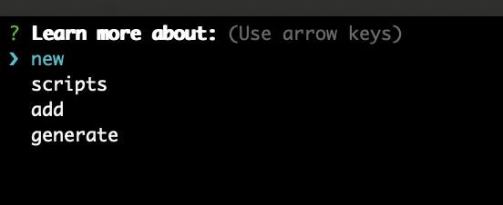

# help
> Help me, Obi-Wan Kenobi. You're my only hope. - Princess Leia

The help command is perfect for when you get stuck or can't remember what a command does.
Simply run ```blix help``` and you'll get a dropdown of the complex Blix commands. Use your arrow keys 
to select one and press enter.



If you want to see a list of ALL commands just run ```blix```