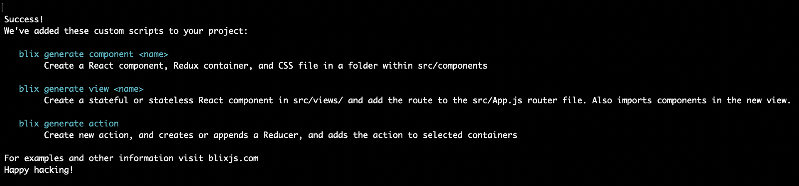

# Add Redux + React-Router to Create React App
> You can’t innovate on products without first innovating the way you build them. - Alex Schleifer

Create-React-App is an wonderful project and it's zero configuration is amazing.
However it isn't a great place to start if you're looking to build a production application.
With the **[Blix add](/commands/add.html)** command you can combine the power of CRA with the tools you need to take your app to the big leagues.

Let's create a new create-react-app project and use Blix to add React-Router + Redux in seconds. 

First thngs first:
```bash
npx create-react-app my-project
```

Navigate into your new project. If you don't have Blix installed at this point that's ok, run:
```bash
npx blix@next add
# OR If you have Blix installed globally
blix add
```

You'll see a list of tools you can add to your project. Use the arrow keys to navigate to "redux" and press enter.

```bash
Mutating a project can cause loss of files. Make sure you have everything committed.
? Do you want to continue:  (Y/n) 
```

You'll then be greeted by this scary message asking if you want to continue. Press "y" and hit enter (if you're not scared off :wink:).

Next a prompt will appear asking if you want to also add React Router which we do. Press "y" and hit enter again.
```bash
? Do you want to add React Router:  (Y/n) 
```

Awesome! Next a list of actions Blix is taking and files affected are listed. Afterwards the Redux and React Router dependencies are installed.

Once all that is completed you'll see a set of familiar looking instructions listing scripts added to your project. These can be used to generate components, apis, views, and redux actions very quickly.




Don't worry about memorizing them. their instructions have been added to your README.md, or you can check the ```package.json``` scripts. You can also look them up here!

If you're wondering what the heck the scripts do check out our [scripts page](/commands/scripts.html). If you want to know how to work them checkout the [basics](/guide/basics/scripts.html)

Your project should now look like this:

```bash
node_modules
scripts/
    templates/
        action.js
        container.js
        reducer.js
        statefulComponent.js
        statelessComponent.js
    action.js
    component.js
    view.js
src/
    actions/
        index.js
    components/
        App/
            App.css
            App.js
            App.test.js
            AppContainer.js
            logo.svg
    reducers/
        rootReducer.js
    views/
        Home.js
    configStore.js
    index.css
    index.js
    Router.js
    serviceWorker.js
.gitignore
package.json
README.md
```
Ignore the scripts folder for now. Let's go over the new ```src/```

One of the first changes you'll note is the actions, and reducers folders.
Redux actions are created in a basic index.js file until it get's large enough that it makes sense to break that file into more manageable sizes.
Redux reducers haven't been created yet but they'll be in separate files.

The Views folder treates pages as "views". Inspired by the Vue-CLI. Each View's routing is handled via the Router.js file.

The initial App folder and some other files like logo.svg were moved into ```src/components/App```. A Redux container file was created that imports the App component where it is then imported into the Home View. So when you run start it 
may seem like nothing has changed. But trust us, EVERYTHING has changed.

Thanks for following along, I hope you build something amazing!

<iframe src="https://giphy.com/embed/HJ8NsNtn9VswE" width="480" height="204" frameBorder="0" class="giphy-embed" allowFullScreen></iframe><p><a href="https://giphy.com/gifs/day-reddit-year-HJ8NsNtn9VswE">via GIPHY</a></p>


