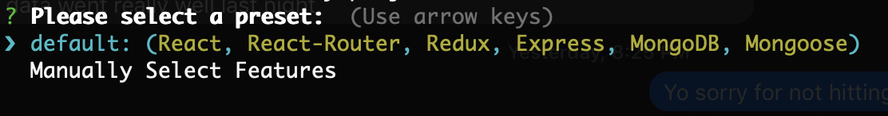

# Create a new default project
> Speed is the essence of war - Sun Tzu

When creating a new project you'll have the option to configure it yourself or use a default. 
Currently our default option is a React, React-Router, Redux frontend paired with Express, MongoDB and Mongoose for the backend.

Let's light this candle! Run:

```
npx blix new my-project
```
You should see this:


Press enter to select the default option. 
You'll then be prompted if you want to use [Yarn](https://yarnpkg.com/en/) to install dependencies: we recommend doing this for the download speed and other benefits.
After making your choice you'll see dozens of files and folders being created with dependencies and devdependencies also getting installed. 
This may take a minute or two depending upon your internet connection.

Ok great, your new project is ready to rock and roll!
If you're an advanced Javascript developer you can easily get started by checking the package.json and going from there. 
If you're wanting to learn a little more before you start creating the next big thing we'll start by exploring the start commands.


